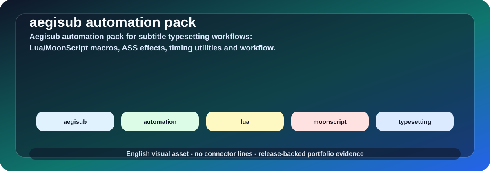

# Aegisub Automation Pack

<p align="center">
  
</p>

<h2 align="center">🎬 Bộ công cụ Aegisub cho fansub, typesetting, motion và hiệu ứng phụ đề ASS</h2>

<p align="center">
  
</p>

<p align="center">
  
  
  
  
</p>

<p align="center">
  <a href="https://github.com/lhlizdabezt">GitHub Lương Hải Long</a>
  ·
  <a href="https://github.com/lhlizdabezt?tab=repositories">Portfolio repositories</a>
  ·
  <a href="https://github.com/lhlizdabezt/aegisub-automation-pack/releases">Releases</a>
  ·
  <a href="docs/CASE_STUDY_KYOUKAI.md">Case study hiệu ứng</a>
</p>

<p align="center">
  
</p>

---

## 🌟 Tóm tắt

Đây là bộ automation Aegisub được đóng gói lại thành một repo portfolio có cấu trúc rõ ràng: macro Lua/MoonScript, thư viện `include`, cấu hình hotkey, công cụ shape/vector, motion tracking, gradient, color track và workflow dựng phụ đề `.ass` sạch.

Repo này không chỉ để “lưu script”. Mục tiêu là biến một workspace typesetting thật thành artifact GitHub có thể review được:

| Người xem | Thứ họ thấy ngay |
| --- | --- |
| HR / tuyển dụng | Có sản phẩm rõ ràng, có visual, có release, có tài liệu tiếng Việt dễ đọc |
| Kỹ sư / reviewer | Có cấu trúc thư mục, dependency, macro, ví dụ ASS, quy trình render và ghi chú giới hạn |
| Fansub / typesetter | Có thể clone về thử macro, tham khảo cách tổ chức hiệu ứng, fade, blur, border, gradient |
| Chính tác giả | Có bộ cấu hình Aegisub có thể phục hồi nhanh khi đổi máy hoặc làm project mới |

---

## ✨ Điểm nổi bật

| Nhóm | Nội dung | Giá trị kỹ thuật |
| --- | --- | --- |
| Macro tự động | `automation/autoload/` | Gom các script xử lý line, timing, shape, gradient, motion và export |
| Thư viện dùng chung | `automation/include/` | Giữ đúng dependency để macro resolve module ổn định trong Aegisub |
| Cấu hình làm việc | `config/`, `zeref-cfg/`, `hotkey.json` | Khôi phục môi trường làm phụ đề nhanh, ít lỗi do thiếu config |
| Hiệu ứng ASS | `examples/effects/` và `docs/HIEU_UNG_ASS.md` | Có snippet thật cho glow 2 layer, phase màu, blur/bord kiểu Tamako |
| Case study | `docs/CASE_STUDY_KYOUKAI.md` | Ghi lại cách chỉnh màu, fade, blur, layer và render preview từ project thực tế |
| Visual portfolio | `assets/` | Banner SVG, GIF workflow, sơ đồ pipeline để repo nhìn chuyên nghiệp hơn |

---

## 🧰 Có gì trong repo?

| Đường dẫn | Vai trò |
| --- | --- |
| `automation/autoload/` | Macro Lua/MoonScript được Aegisub nạp tự động |
| `automation/include/` | Module phụ trợ: ASS parsing, shape, JSON, timing, clipping, image, native DLL |
| `config/` | Cấu hình riêng cho macro/plugin |
| `zeref-cfg/` | Cấu hình nhóm macro Zeref |
| `hotkey.json` | Bộ phím tắt Aegisub đã gom lại để phục hồi nhanh |
| `examples/effects/` | Snippet ASS đã tinh chỉnh từ workflow thực tế |
| `docs/` | Tài liệu cài đặt, case study, hiệu ứng, release note và hướng portfolio |
| `assets/` | Visual: banner SVG, GIF workflow và sơ đồ pipeline |

---

## 🎛️ Macro nổi bật

| Nhóm | Macro / module | Gợi ý tác vụ |
| --- | --- | --- |
| Timing và line tool | `ua.Recalculator.lua`, `ua.Relocator.lua`, `ua.NecrosCopy.lua` | Căn chỉnh, di chuyển, copy và xử lý line nhanh |
| Fade và màu | `ua.FadeWorks.lua`, `ua.Colorize.lua`, `phos.AutoFade.moon`, `zah.aegi-color-track.lua` | Tạo fade, đổi màu theo phase, kiểm soát tag màu |
| Shape và vector | `ILL.Shapery.moon`, `lyger.GradientEverything.moon`, `lyger.ClipGrad.lua` | Xử lý shape, gradient, clip, vector typesetting |
| Motion | `a-mo.Aegisub-Motion.moon`, `l0.MoveAlongPath.moon`, `phos.wobble.moon` | Motion path, wobble, transform theo khung hình |
| Import/export | `petzku.EncodeClip.lua`, `lyger.Image2ASS.lua`, `l0.PasteAiLines.moon` | Encode clip, ảnh sang ASS, paste line từ nguồn ngoài |

---

## 🚀 Cài đặt nhanh trên Windows

Clone repo vào thư mục cấu hình roaming của Aegisub:

```powershell
cd "$env:APPDATA"
git clone https://github.com/lhlizdabezt/aegisub-automation-pack.git Aegisub
```

Nếu máy đã có thư mục Aegisub, nên sao lưu trước rồi copy phần cần dùng:

```powershell
Copy-Item .\automation "$env:APPDATA\Aegisub" -Recurse -Force
Copy-Item .\config "$env:APPDATA\Aegisub" -Recurse -Force
Copy-Item .\zeref-cfg "$env:APPDATA\Aegisub" -Recurse -Force
Copy-Item .\hotkey.json "$env:APPDATA\Aegisub\hotkey.json" -Force
```

Sau khi copy, đóng Aegisub hoàn toàn rồi mở lại để chương trình nạp macro trong `automation/autoload/`.

---

## 🧪 Quy trình dùng gợi ý

1. Mở Aegisub và kiểm tra menu `Automation`.
2. Mở một file `.ass` thử nghiệm trước khi áp lên project thật.
3. Chọn nhóm macro phù hợp: timing, color, shape, motion, gradient hoặc export.
4. Render preview bằng FFmpeg/libass để kiểm tra blur, border, fade, màu và layer.
5. Khi đã ổn, commit lại snippet hoặc case study vào `examples/` / `docs/`.

```powershell
ffmpeg -i input.mkv -vf "ass='subtitle.ass'" -frames:v 1 preview.png
```

---

## 🎨 Sản phẩm và case study

Repo có thêm phần tài liệu hóa các hiệu ứng đã làm trong workflow thực tế:

| Hạng mục | File |
| --- | --- |
| Hiệu ứng glow 2 layer kiểu Tamako | `examples/effects/tamako-glow-2-layer.ass` |
| Phase màu cho lyric theo scene | `examples/effects/kyoukai-phase-color-snippets.ass` |
| Ghi chú hiệu ứng ASS | `docs/HIEU_UNG_ASS.md` |
| Case study Kyoukai no Kanata OP | `docs/CASE_STUDY_KYOUKAI.md` |
| Định vị portfolio kỹ thuật | `docs/PORTFOLIO.md` |

Các ví dụ chỉ chứa snippet kỹ thuật và mô tả workflow. Repo không kèm video/anime gốc hoặc bản phụ đề nguồn có bản quyền.

---

## 🖼️ Preview tự tạo

Các ảnh dưới đây được render từ nền màu tổng hợp và snippet trong `examples/effects/`, không dùng video/anime gốc.

| Glow 2 layer | Phase màu |
| --- | --- |
|  |  |

---

## 🧭 Pipeline hiệu ứng

<p align="center">
  
</p>

---

## 🧹 Những gì không đưa vào repo

| Nhóm | Ví dụ |
| --- | --- |
| Backup và autosave | `autoback/`, `autosave/`, `recovered/` |
| Log và crash dump | `log/`, `crashdumps/`, `feedDump/` |
| Cache và lịch sử local | `catalog/`, `mru.json`, `shift_history.json` |
| Cấu hình tuyệt đối theo máy | `config.json`, `aegisub-motion.json`, `aegisub-motion.stats.json` |
| Media có bản quyền | video anime, audio, subtitle nguồn đầy đủ nếu không có quyền phân phối |

---

## 🧩 Ghi chú dependency và tác quyền

Một số macro dùng thư viện bên thứ ba hoặc native DLL đi kèm. Repo giữ nguyên cấu trúc thư mục để macro hoạt động đúng trong Aegisub. Khi tái phân phối từng macro hoặc module riêng lẻ, cần kiểm tra header/license upstream của module đó.

Repo này được trình bày như bộ cấu hình, workflow và ví dụ kỹ thuật cá nhân. Các snippet hiệu ứng tự viết được tách riêng trong `examples/` để dễ review.

---

## 🏷️ Release

| Phiên bản | Nội dung | Trạng thái |
| --- | --- | --- |
| `v1.1.0` | Sửa UTF-8 README/CHANGELOG, thêm docs case study, snippets hiệu ứng, visual pipeline và metadata portfolio | Khuyến nghị |
| `v1.0.0` | Đóng gói lần đầu bộ macro, include library, config, hotkey và visual cơ bản | Ổn định |

---

## 👤 Tác giả

**Lương Hải Long**

Sinh viên **Điện tử Viễn thông**, quan tâm đến **Verilog, C/C++, Python, Trí tuệ nhân tạo, Kaggle, IPYNB**, hệ thống nhúng và workflow automation có thể tái sử dụng.

Repo này nằm trong portfolio kỹ thuật tại [github.com/lhlizdabezt](https://github.com/lhlizdabezt), được trình bày theo hướng rõ ràng cho cả HR lẫn engineering review.
