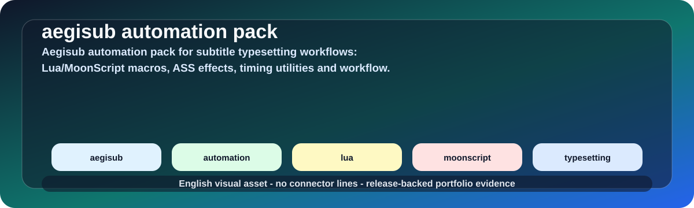
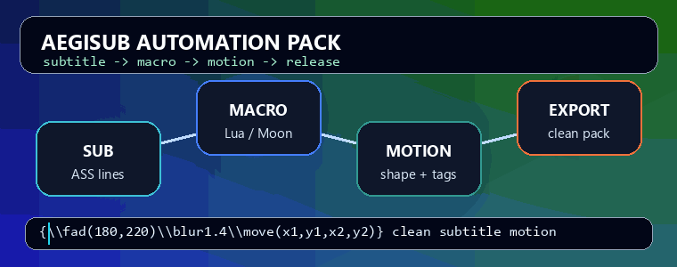

# Aegisub Automation Pack for Subtitle Typesetting

<p align="center">
  <a href="https://github.com/lhlizdabezt/aegisub-automation-pack/releases/latest"></a>
  <a href="https://github.com/lhlizdabezt/aegisub-automation-pack/tags"></a>
  <a href="https://github.com/lhlizdabezt"></a>
  
</p>

<p align="center">
  
</p>

## Overview

This repository packages an Aegisub automation workflow for subtitle typesetting practice: Lua and MoonScript macros, ASS effect helpers, timing utilities, color or gradient tools, motion-tracking support, reusable configs and small synthetic examples.

It is presented as a portfolio artifact for scripting, workflow automation and media-tool QA. It is not a commercial subtitle product, and it does not redistribute original anime/video media or full source subtitle files.

| Field | Details |
|---|---|
| Repository | [aegisub-automation-pack](https://github.com/lhlizdabezt/aegisub-automation-pack) |
| Owner | [Luong Hai Long](https://github.com/lhlizdabezt) |
| Portfolio track | Automation tooling, subtitle workflow scripting, technical documentation |
| Primary stack | Aegisub, Lua, MoonScript, ASS subtitles, automation macros, motion tracking, FFmpeg/libass review |
| Release status | [Latest release](https://github.com/lhlizdabezt/aegisub-automation-pack/releases/latest) |
| Tags | [Version tags](https://github.com/lhlizdabezt/aegisub-automation-pack/tags) |
| Profile links | [GitHub](https://github.com/lhlizdabezt), [LinkedIn](https://www.linkedin.com/in/lhlizdabezt), [YouTube](https://www.youtube.com/@lhlizdabezt), [TikTok](https://www.tiktok.com/@wageseadrake) |

## Visual Evidence

<p align="center">
  
</p>

<p align="center">
  
  
</p>

The visual assets are checked into the repository so reviewers do not depend on external banner services. SVG text is English and ASCII-safe, with no connector lines placed behind labels.

## Reviewer Map

| Review need | Start here | What it proves |
|---|---|---|
| Quick project scan | `README.md`, `docs/PORTFOLIO.md` | Scope, review path, repository boundaries |
| Automation scripts | `automation/autoload/`, `automation/include/` | Lua and MoonScript macro material used in Aegisub workflows |
| Config examples | `config/`, `zeref-cfg/`, `*.conf`, `hotkey.json` | Repeatable local workflow settings without personal recovery data |
| ASS effect thinking | `docs/HIEU_UNG_ASS.md`, `docs/CASE_STUDY_KYOUKAI.md` | Layering, glow, timing and crop-preview decisions |
| Synthetic evidence | `examples/effects/`, `assets/` | Reviewable snippets and visuals without copyrighted media |
| Version history | `CHANGELOG.md`, `RELEASE_NOTES.md`, GitHub releases | Auditable public snapshots |

## Evidence Highlights

- Curated Aegisub automation folders with Lua and MoonScript macros for subtitle grid operations, tags, shapes, gradients, motion data and workflow utilities.
- ASS effect notes that explain two-layer glow construction, phase-aware color decisions and fast crop-preview verification.
- Synthetic `.ass` examples for reviewable effect snippets without original video redistribution.
- Visual assets stored under `assets/` for GitHub README rendering, including a line-free animated SVG, workflow GIF and static preview PNGs.
- Release-backed documentation and repository metadata for HR, engineering and academic portfolio review.

## Repository Structure

| Path | Purpose |
|---|---|
| `automation/autoload/` | Aegisub macro entry points loaded by the Automation manager |
| `automation/include/` | Shared Lua/MoonScript modules and bundled runtime dependencies |
| `config/` | Macro configuration files that make repeated operations reproducible |
| `docs/` | Portfolio notes, ASS effect notes and workflow case study |
| `examples/effects/` | Synthetic ASS snippets for glow and phase-color review |
| `assets/` | Self-hosted SVG, GIF and PNG visual evidence for GitHub rendering |
| `CHANGELOG.md` | Human-readable project history |
| `RELEASE_NOTES.md` | Latest public release notes |

## How to Use

1. Install Aegisub or a compatible maintained build.
2. Copy selected files from `automation/autoload/` into the Aegisub automation autoload directory.
3. Copy required shared modules from `automation/include/` when a macro depends on them.
4. Place any matching config file from `config/` or the top-level `.conf` files into the expected Aegisub config path.
5. Restart Aegisub or reload automation scripts.
6. Open a test `.ass` file, select a small line group and run the macro from the Automation menu.
7. Review output on a synthetic sample first before using the workflow on real subtitle work.

## Verification

Render a cropped subtitle preview with FFmpeg/libass:

```powershell
ffmpeg -i input.mp4 -vf "ass=preview.ass,crop=1920:320:0:760" -frames:v 1 preview.png
```

Check SVG text safety:

```powershell
@'
from pathlib import Path
for path in Path("assets").glob("*.svg"):
    bad = sorted({ch for ch in path.read_text(encoding="utf-8") if ord(ch) > 127})
    print(path, "non_ascii=", len(bad))
'@ | python -
```

Inspect the current release:

```powershell
gh release view --repo lhlizdabezt/aegisub-automation-pack
```

## FAQ

| Question | Answer |
|---|---|
| Is this a production subtitle platform? | No. It is a portfolio and workflow automation pack for Aegisub practice and review. |
| Does it include original anime/video media? | No. The repository keeps technical snippets and synthetic previews only. |
| Why Lua and MoonScript? | Aegisub automation workflows commonly use Lua, while several community macro systems and helpers are written in MoonScript. |
| Why include visuals? | The visuals make the repository reviewable quickly and show that the documentation was checked for GitHub rendering. |
| What should reviewers focus on first? | Read the overview, inspect `automation/autoload/`, then check the docs and synthetic effect examples. |

## Scope and Boundaries

This repository demonstrates scripting discipline, documentation, release packaging and subtitle-workflow automation. Some automation material references public community tooling and dependency metadata. The portfolio claim is about maintaining, packaging, documenting and applying the workflow, not claiming authorship of every upstream Aegisub ecosystem dependency.

## Portfolio Context

Luong Hai Long is an Electronics and Telecommunications Engineering student at VNUHCM - University of Science. This repository supports a broader engineering portfolio that also includes computer vision, AI/ML, network communications, FPGA/SoC and embedded systems work.

## Contact

| Channel | Link |
|---|---|
| Work email | [luonghailong.work@gmail.com](mailto:luonghailong.work@gmail.com) |
| Student email | [22207056@student.hcmus.edu.vn](mailto:22207056@student.hcmus.edu.vn) |
| Phone | [+84 988 114 708](tel:+84988114708) |
| GitHub | [github.com/lhlizdabezt](https://github.com/lhlizdabezt) |
| LinkedIn | [linkedin.com/in/lhlizdabezt](https://www.linkedin.com/in/lhlizdabezt) |
| Facebook | [facebook.com/wageseadrake](https://www.facebook.com/wageseadrake) |
| Instagram | [instagram.com/lhlizdabezt](https://www.instagram.com/lhlizdabezt) |
| YouTube | [youtube.com/@lhlizdabezt](https://www.youtube.com/@lhlizdabezt) |
| TikTok | [tiktok.com/@wageseadrake](https://www.tiktok.com/@wageseadrake) |

## Writing Standard

The public text is written in US English with a restrained, evidence-first style: clear technical nouns, bounded claims, explicit source paths, release-backed assets and no unsupported superlatives.
